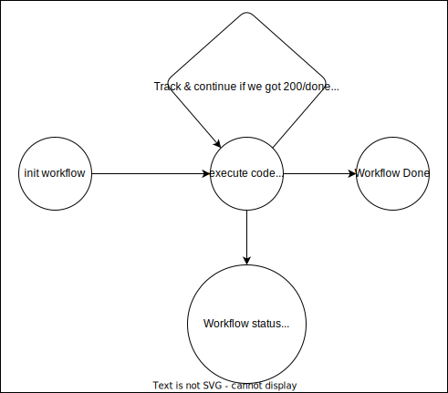

# `fetch-each` - Distributed HTTP requests using CloudFlare Workers

> **Important**: Self-hosting on CloudFlare Workers is required to use this package.

`fetch-each` uses [CloudFlare queues](https://developers.cloudflare.com/queues/) and [durable objects](https://developers.cloudflare.com/durable-objects/) to execute many HTTP requests in parallel while avoiding worker concurrency limits.

## Setup

### 1. Deploy Your Own Instance

```bash
# Clone the repository
git clone https://github.com/CodeFromAnywhere/fetch-each
cd fetch-each

# Create required CloudFlare queue
npx wrangler queues create fetch-each-queue

# Deploy to CloudFlare
npx wrangler deploy
```

The deployment will provide you with a URL endpoint. Save this as your `basePath` for client usage.

### 2. Install Client Package

```bash
npm install @cfa/fetch-each
```

## Usage

All examples require your deployed worker URL as `basePath` and your configured secret as `apiKey`.

### Basic HTTP Requests

```typescript
import { fetchEach } from "@cfa/fetch-each";

const results = await fetchEach(
  ["https://api1.example.com", "https://api2.example.com"],
  {
    apiKey: "YOUR_SECRET", // Set in CloudFlare
    basePath: "YOUR_WORKER_URL", // From deployment
    log: console.log, // Optional progress logging
  },
);
```

### POST Requests Example

```typescript
const results = await fetchEach(
  [
    {
      url: "https://api.example.com/endpoint1",
      method: "POST",
      body: { data: "example1" },
      headers: { "Content-Type": "application/json" },
    },
    {
      url: "https://api.example.com/endpoint2",
      method: "POST",
      body: { data: "example2" },
      headers: { "Content-Type": "application/json" },
    },
  ],
  {
    apiKey: "YOUR_SECRET",
    basePath: "YOUR_WORKER_URL",
  },
);
```

### LLM Requests Example

```typescript
import { fetchEach } from "@cfa/fetch-each";

const structuredOutputs = async <T>(
  llmConfig: {
    llmBasePath: string;
    llmApiKey: string;
    llmModelName: string;
  },
  messagesArray: { role: string; content: string }[][],
) => {
  const results = await fetchEach<T>(
    messagesArray.map((messages) => ({
      url: "https://chatcompletions.com/chat/completions",
      method: "POST",
      body: {
        model: llmConfig.llmModelName,
        messages,
      },
      headers: {
        "X-LLM-Base-Path": llmConfig.llmBasePath,
        "X-LLM-API-Key": llmConfig.llmApiKey,
        "X-Output": "codeblock.json",
      },
    })),
    {
      log: (s) => console.log(s, llmConfig),
      apiKey: "YOUR_SECRET",
      basePath: "YOUR_WORKER_URL",
    },
  );

  return results.map((x) => x.result);
};
```

## Features

- Execute thousands of HTTP requests in parallel
- Built-in retry mechanism for failed requests
- Real-time status updates via Server-Sent Events
- Progress tracking with success/failure counts
- Simple API matching `fetch` interface

## Limitations

- **Max I/O size ±100MB**: Will not work for JSON inputs or outputs larger than ±100MB
- **Max item size < 128kb**: Due to queue message size limit
- **Max 250 concurrent, max 5000 rps**: Uses a single CloudFlare queue with max throughput of 5000 messages per second and 250 concurrent requests ([CloudFlare queue limits](https://developers.cloudflare.com/queues/platform/limits/))

## How It Works


`fetch-each` distributes requests across multiple workers using CloudFlare's queue system while maintaining a simple API interface. Progress is tracked using durable objects, enabling real-time status updates and retry handling.

## Related work and wishlist

Related:

- https://github.com/codefromanywhere/actionschema.dmap (Same but uses https://github.com/CodeFromAnywhere/evaloncloud to do code execution rather than just requests)
- https://github.com/CodeFromAnywhere/queue-workflow-experiments (Experiments to make queue workflows)

Wishlist:

- If we have **instant 202 and callback** for any fetchEach request, we can build workflows that return to the workflow only after a queue has finished. This allows more efficient short-running functions
- It would be great to keep state in r2 on the workflow step level, where a workflow can run any code as long as it uses fetchEach for concurrent http requests.


